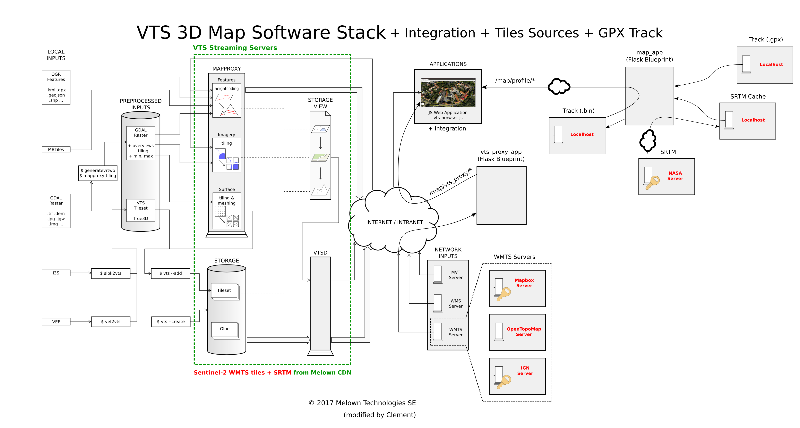

Map Player
----------

Overview
^^^^^^^^

This awesome interactive 3D map viewer displaying a track and the elevation profile
is mostly based on the VTS Browser JS demo:
https://vts-geospatial.org/tutorials/gpx-viewer.html

The differences with the original demo are:

* Removed the GPX drop capability because the track is automatically loaded,
* Rewrote the GPX loading function to handle a `WebTrack <https://github.com/ExploreWilder/WebTrack.js>`,
* Removed the slow geodata.processHeights() because my custom format already includes the elevation,
* Removed the search box and the 2D/3D button,
* Replaced the canvas profile to be like the 2D map viewer,
* Changed the interface style and nested the map in my layout,
* Optimized onFeatureHover() to skip useless heavy computation,
* Changed centerPositonToGeometry() in a way to move the track above the elevation profile,
* Fixed some NaN errors on tooltips.

Please refer to the following image for a graphical overview of the interface to the Map Player running vts-browser-js:

Module
^^^^^^

.. js:autoattribute:: extra_height
.. js:autoattribute:: zbuffer_offset
.. js:autoattribute:: timeoutHideMapPointerID
.. js:autoattribute:: timeoutHideMap
.. js:autoattribute:: partialRedraw

.. js:autofunction:: map_player.update_hiker_pos
.. js:autofunction:: loadTexture
.. js:autofunction:: onMapLoaded
.. js:autofunction:: loadTrack
.. js:autofunction:: webtrack_to_geodata
.. js:autofunction:: onHeightProcessed
.. js:autofunction:: centerPositonToGeometry
.. js:autofunction:: onMouseMove
.. js:autofunction:: onMouseLeave
.. js:autofunction:: onFeatureHover
.. js:autofunction:: onCustomRender
.. js:autofunction:: onSwitchView
