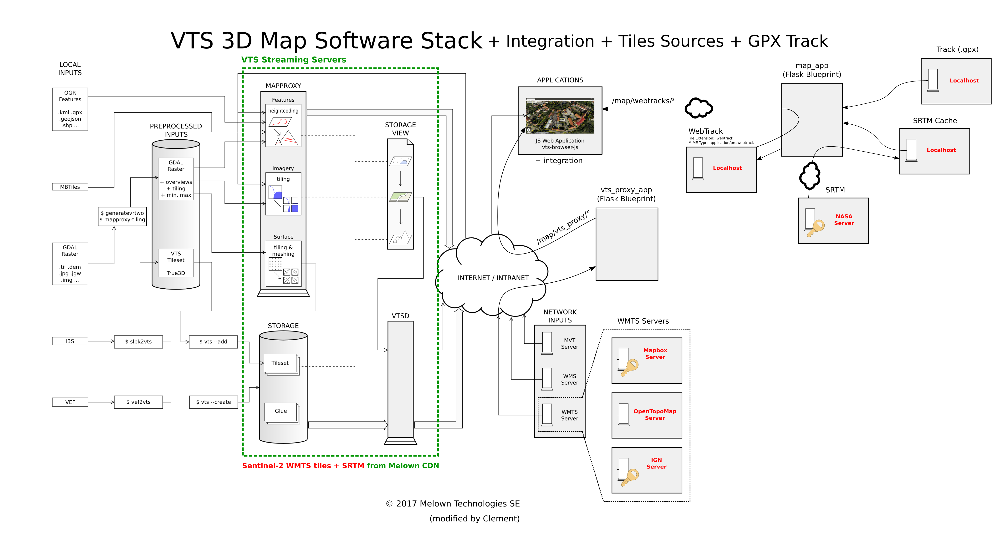

Map Player
----------

Overview
^^^^^^^^

This awesome interactive 3D map viewer displaying a track and the elevation profile
is mostly based on the `VTS Browser JS demo <https://vts-geospatial.org/tutorials/gpx-viewer.html>`_.

The differences with the original demo are:

* Removed the GPX drop capability because the track is automatically loaded,
* Rewrote the GPX loading function to handle a `WebTrack <https://github.com/ExploreWilder/WebTrack.js>`_,
* Removed the slow `geodata.processHeights()` because the WebTrack already includes the elevation,
* Removed the search box and the 2D/3D button,
* Replaced the canvas profile to look like the 2D map viewer,
* Changed the interface style and nested the map in my layout,
* Optimized `onFeatureHover()` to skip useless heavy computation,
* Fixed some NaN errors on tooltips.

Please refer to the following image for a graphical overview of the interface to the Map Player running VTS Browser JS:

Details About the Map Configuration
^^^^^^^^^^^^^^^^^^^^^^^^^^^^^^^^^^^

Information about the map configuration (``mapConfig.json`` in the VTS terms) are available
`here <https://github.com/melowntech/vts-mapproxy/blob/master/docs/resources.md>`_.
For a more in-depth configuration, you can find an
example `here <https://rigel.mlwn.se/mountain-map/>`_
and `there <https://github.com/ondra-prochazka/a-3d-mountain-map>`_.

You can edit the style on the fly with the VTS Browser
`Inspector Mode <https://github.com/melowntech/vts-browser-js/wiki/VTS-Browser-Inspector-Mode>`_
(Ctrl+Shift+D then Shift+E). Refer to
`here <https://github.com/melowntech/vts-browser-js/wiki/VTS-Geodata-Format#layers-structure>`_
and `there <https://vts-geospatial.org/tutorials/geojson.html>`_
for more documentation about properties.

Module
^^^^^^

.. js:autoattribute:: extra_height
.. js:autoattribute:: timeoutHideMapPointerID
.. js:autoattribute:: timeoutHideMap
.. js:autoattribute:: partialRedraw

.. js:autofunction:: map_player.update_hiker_pos
.. js:autofunction:: startMapPlayerInterface
.. js:autofunction:: loadTexture
.. js:autofunction:: onMapLoaded
.. js:autofunction:: loadTrack
.. js:autofunction:: webtrack_to_geodata
.. js:autofunction:: onHeightProcessed
.. js:autofunction:: centerPositonToGeometry
.. js:autofunction:: onMouseMove
.. js:autofunction:: onMouseLeave
.. js:autofunction:: onFeatureHover
.. js:autofunction:: onCustomRender
.. js:autofunction:: onSwitchView
