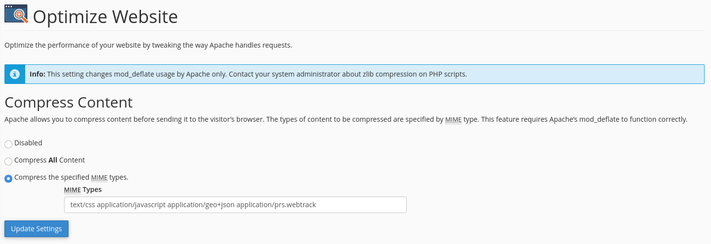

Setup
=====

Offline
-------

This section details how to install the application locally (for development, debug and test purposes.)

On Debian-based Operating Systems
^^^^^^^^^^^^^^^^^^^^^^^^^^^^^^^^^

**Install the required deb packages**

Run as root:

.. code-block:: none

    apt-get update -y
    apt-get install -y python3-pip python3-dev python3-pytest cloc \
    git wget default-mysql-client default-mysql-server

**Install Node.js & npm Packages**

The `latest LTS version <https://nodejs.org/en/download/>`_ is recommended. Therefore, update the version and execute the following commands as root:

.. code-block:: none

    echo 'VERSION=v14.15.0 && DISTRO=linux-x64 && export PATH=/usr/local/lib/nodejs/node-$VERSION-$DISTRO/bin:$PATH' >> ~/.profile
    . ~/.profile
    mkdir -p /usr/local/lib/nodejs
    wget https://nodejs.org/dist/$VERSION/node-$VERSION-$DISTRO.tar.xz
    tar -xJvf node-$VERSION-$DISTRO.tar.xz -C /usr/local/lib/nodejs
    rm -f node-$VERSION-$DISTRO.tar.xz
    npm -g config set ignore-scripts true # don't run scripts as sudo
    npm install -g jsdoc gulp-cli @mapbox/togeojson

In the step above, the *PATH* is exported for root, whereas the step below exports the *PATH* for the user.

Run as user:

.. code-block:: none

    echo 'VERSION=v14.15.0 && DISTRO=linux-x64 && export PATH=/usr/local/lib/nodejs/node-$VERSION-$DISTRO/bin:$PATH' >> ~/.profile
    . ~/.profile
    git clone https://github.com/ExploreWilder/MainWebsite
    cd MainWebsite/flaskr/static/
    npm config set ignore-scripts false
    npm install # dev + prod dependencies

**Install the Python virtual environment (venv)**

Run as user:

.. code-block:: none

    cd ../.. # go to MainWebsite
    pip3 install --user virtualenv
    export PATH=~/.local/bin:$PATH
    virtualenv -p /usr/bin/python3.8 venv

More information about venv: `virtual environment <https://docs.python-guide.org/dev/virtualenvs/>`_.

**Install the Python dependencies inside the venv**

Run as user:

.. code-block:: none

    cd MainWebsite
    source venv/bin/activate
    `pwd`/venv/bin/python3 -m pip install --upgrade pip
    pip3 install -U setuptools
    
    mkdir dkimpy
    cd dkimpy
    dkim_major_version=1.0
    dkim_minor_version=5
    dkim_version=${dkim_major_version}.${dkim_minor_version}
    wget https://launchpad.net/dkimpy/${dkim_major_version}/${dkim_version}/+download/dkimpy-${dkim_version}.tar.gz
    tar -zxvf dkimpy-${dkim_version}.tar.gz
    cd dkimpy-${dkim_version}
    python3 setup.py install --single-version-externally-managed --record=/dev/null
    cd ../..
    rm -rf dkimpy
    
    pip3 install -r requirements.txt
    pip3 install -r require_dev.txt # for development only

**Configure MySQL**

Run as root:

.. code-block:: none

    mysql -u root -p # then press Enter (empty password)
    mysql> USE mysql;
    mysql> UPDATE user SET plugin='mysql_native_password' WHERE User='root';
    mysql> FLUSH PRIVILEGES;
    mysql> exit;
    systemctl restart mysql
    mysqladmin -u root password 'root'

**Configure the Website**

Update the config.py file with the MySQL settings and choose a database name. The following command will create the database and tables based on schema.sql.

Run as user:

.. code-block:: none

    cd MainWebsite
    source venv/bin/activate
    export FLASK_APP=flaskr
    export FLASK_ENV=development
    flask init-db # you should read "Success: Database initialized."
    deactivate # quit venv (optional)
    mkdir -v flaskr/captchas books photos otm_cache twitter_cache mastodon_cache # create directories required for tests
    make dist # generate the static files

On Fedora
^^^^^^^^^

The differences are detailed below.

**Install the required dnf packages**

Run as root:

.. code-block:: none

    dnf install git python3-pytest cloc

**Configure MySQL**

More details `here <https://dev.mysql.com/doc/mysql-repo-excerpt/8.0/en/linux-installation-yum-repo.html>`_.

#. download the rpm
#. download the `GPG pubkey <https://dev.mysql.com/doc/refman/8.0/en/checking-gpg-signature.html>`_
#. import the key into rpm: ``sudo rpm --import mysql_pubkey.asc``
#. check the rpm GPG signature: ``rpm --checksig mysql80-community-release-fc31-1.noarch.rpm``
#. install the downloaded package: ``sudo dnf localinstall mysql80-community-release-fc31-1.noarch.rpm``
#. upgrade MySQL: ``sudo dnf upgrade``
#. start MySQL: ``sudo service mysqld start``
#. find out the temporary root password: ``sudo grep 'temporary password' /var/log/mysqld.log``
#. login: ``mysql -u root -p``
#. change the password: ``mysql> ALTER USER 'root'@'localhost' IDENTIFIED BY 'your local password';``

Online
------

Go to your cPanel and click on "Setup Python App" in the "Software" tab:

.. image:: _images/cpanel_start_setup_python_app.png

Then create a new app:

.. image:: _images/cpanel_create_python_app.png

Then choose the latest Python version and the application root directory. Finally, enter into the created venv, install the Python dependencies as detailed above, copy the app and data, setup your MySQL database.

Apache mod_deflate
^^^^^^^^^^^^^^^^^^

The Apache mod_deflate is configured as below:

