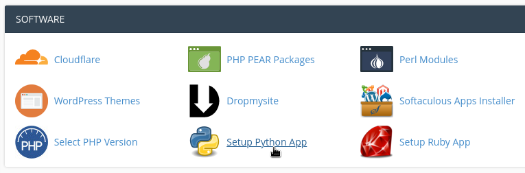

Setup
=====

Offline
-------

This section details how to install the application locally (for development, debug and test purposes.)

On Debian-based Operating Systems
^^^^^^^^^^^^^^^^^^^^^^^^^^^^^^^^^

**Install the required deb packages**

Run as root:

.. code-block:: none

    apt-get update -y
    apt-get install -y python3-pip python3-dev python3-pytest cloc \
    git wget default-mysql-client default-mysql-server

**Install Node.js & npm Packages**

Run as root:

.. code-block:: none

    VERSION=v12.16.1
    DISTRO=linux-x64
    mkdir -p /usr/local/lib/nodejs
    wget https://nodejs.org/dist/$VERSION/node-$VERSION-$DISTRO.tar.xz
    tar -xJvf node-$VERSION-$DISTRO.tar.xz -C /usr/local/lib/nodejs
    export PATH=/usr/local/lib/nodejs/node-$VERSION-$DISTRO/bin:$PATH
    . ~/.profile
    rm -f node-$VERSION-$DISTRO.tar.xz
    npm -g config set ignore-scripts true # don't run scripts as sudo
    npm install -g jsdoc gulp-cli @mapbox/togeojson

Run as user:

.. code-block:: none

    git clone https://github.com/ExploreWilder/MainWebsite
    cd MainWebsite/flaskr/static/
    npm config set ignore-scripts false
    npm install # dev + prod dependencies

**Install the Python virtual environment (venv)**

Run as user:

.. code-block:: none

    cd ../.. # go to MainWebsite
    pip3 install --user virtualenv
    virtualenv -p /usr/bin/python3.7 venv

More information about venv: `virtual environment <https://docs.python-guide.org/dev/virtualenvs/>`_.

**Install the Python dependencies inside the venv**

Run as user:

.. code-block:: none

    cd MainWebsite
    source venv/bin/activate
    `pwd`/venv/python/python3 -m pip3 install --upgrade pip
    pip3 install -U setuptools
    
    git clone https://github.com/pallets/secure-cookie.git
    cd secure-cookie
    python3 setup.py install
    cd -
    
    git clone https://github.com/mattupstate/flask-mail.git
    cd flask-mail
    python3 setup.py install
    cd -
    
    git clone https://github.com/tkrajina/gpxpy.git
    cd gpxpy
    python3 setup.py install
    cd -
    
    git clone -b EarthDataLogin --single-branch https://github.com/ExploreWilder/srtm.py
    cd srtm.py
    python3 setup.py install
    cd -

    git clone https://github.com/gkovacs/lz-string-python.git
    cd lz-string-python
    python3 setup.py install
    cd -
    
    mkdir dkimpy
    cd dkimpy
    wget https://launchpad.net/dkimpy/1.0/1.0.4/+download/dkimpy-1.0.4.tar.gz
    tar -zxvf dkimpy-1.0.4.tar.gz
    cd dkimpy-1.0.4
    python3 setup.py install --single-version-externally-managed --record=/dev/null
    cd ../..
    
    python -m pip install git+https://github.com/maxcountryman/flask-seasurf.git
    python -m pip install git+https://github.com/ExploreWilder/mdx_sections.git
    
    pip3 install -r requirements.txt
    pip3 install -r require_dev.txt # for development only

**Configure MySQL**

Run as root:

.. code-block:: none

    mysql -u root -p
    mysql> USE mysql;
    mysql> UPDATE user SET plugin='mysql_native_password' WHERE User='root';
    mysql> FLUSH PRIVILEGES;
    mysql> exit;
    systemctl restart mysql
    mysqladmin -u root password 'root'

**Configure the Website**

Update the config.py file with the MySQL settings and choose a database name. The following command will create the database and tables based on schema.sql.

Run as user:

.. code-block:: none

    cd MainWebsite
    ./utils.sh init-db
    cd flaskr
    mkdir captchas

On Fedora
^^^^^^^^^

The differences are detailed below.

**Install the required dnf packages**

Run as root:

.. code-block:: none

    dnf install git python3-pytest cloc

**Configure MySQL**

More details `here <https://dev.mysql.com/doc/mysql-repo-excerpt/8.0/en/linux-installation-yum-repo.html>`_.

#. download the rpm
#. download the `GPG pubkey <https://dev.mysql.com/doc/refman/8.0/en/checking-gpg-signature.html>`_
#. import the key into rpm: ``sudo rpm --import mysql_pubkey.asc``
#. check the rpm GPG signature: ``rpm --checksig mysql80-community-release-fc31-1.noarch.rpm``
#. install the downloaded package: ``sudo dnf localinstall mysql80-community-release-fc31-1.noarch.rpm``
#. upgrade MySQL: ``sudo dnf upgrade``
#. start MySQL: ``sudo service mysqld start``
#. find out the temporary root password: ``sudo grep 'temporary password' /var/log/mysqld.log``
#. login: ``mysql -u root -p``
#. change the password: ``mysql> ALTER USER 'root'@'localhost' IDENTIFIED BY 'your local password';``

Online
------

Go to your cPanel and click on "Setup Python App" in the "Software" tab:

Then create a new app:

Then choose the latest Python version (I'm using 3.7.3) and the application root directory. Finally, enter the created venv, install the Python dependencies as detailed above, copy the app and data, setup your MySQL database and that's it!
